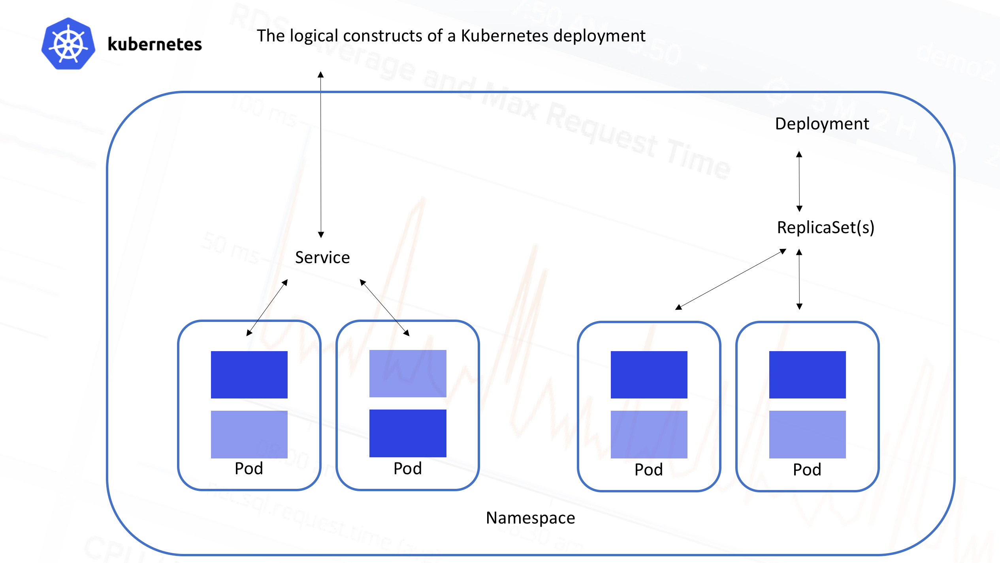

!SLIDE[bg=_images/backgrounds/white_bg.png]

# Kubernetes

* k8s for short
* Founded by Google
* CNCF: Cloud Native Computing Foundation
* Focused on container orchestration

!SLIDE[bg=_images/backgrounds/white_bg.png]

# What is a container

* Usually, just a Docker container
* Strictly, the Open Container Initiative manages this definition
* Process on Linux\*, subject to some sandboxing and restrictions

!SLIDE[bg=_images/backgrounds/white_bg.png]

# What is a container

!SLIDE[bg=_images/backgrounds/white_bg.png]

# Container Orchestration

* Start some containers!
* Which containers are running?
* Did it crash? Restart it!
* Make more of them, but keep them on different physical hosts.

!SLIDE[bg=_images/backgrounds/white_bg.png]

.huge Kubernetes manages containers. Users of kubernetes Manage higher level abstracted resources.

!SLIDE[bg=_images/backgrounds/black_bg.png]

.blockwhite Three 'killer' features:

.blockteal * Automatic Restarts

.blockteal * Horizontal Scaling

.blockteal * Service Discovery

!SLIDE[bg=_images/backgrounds/white_bg.png]

# Horizontal Scaling

* Scale "out" or "in"
* Add (or remove) nodes to a system
* Example would be deploying your webapp to 3 more servers, stick behind a
  load balancer.
* In the past, had to rack a new server, bootstrap the OS and bins/libs, then
  deploy your app.
* Now, we can just deploy more containers to different physical hosts.

!SLIDE[bg=_images/backgrounds/white_bg.png]

# Service Discovery

* We'll come back to this in a bit.

!SLIDE[bg=_images/backgrounds/white_bg.png] commandline incremental

# Working with Kubernetes

    $ kubectl get deploy
    NAME           DESIRED   CURRENT   UP-TO-DATE   AVAILABLE   AGE

    $

!SLIDE[bg=_images/backgrounds/white_bg.png] commandline incremental

# Working with Kubernetes

    $ cat guestbook-deployment.yaml
    apiVersion: apps/v1
    kind: Deployment
    metadata:
      name: guestbook
    spec:
      replicas: 3
      selector:
        matchLabels:
          app: guestbook
    ...
    $ kubectl create -f guestbook-deployment.yaml
    deployment.apps "guestbook" created

!SLIDE[bg=_images/backgrounds/white_bg.png] commandline incremental

# Working with Kubernetes

    $ kubectl get deploy
    NAME           DESIRED   CURRENT   UP-TO-DATE   AVAILABLE   AGE
    redis-master   1         1

!SLIDE[bg=_images/backgrounds/black_bg.png]

.blockwhite Quick Pause

.blockteal Any Account or Cluster issues?

!SLIDE[bg=_images/backgrounds/white_bg.png] incremental

# Kubernetes Resources

* Pod
* Deployment
* Service

!SLIDE[bg=_images/backgrounds/white_bg.png] incremental

# Pod

* Smallest unit of deployment - "the atom"
* Consists usually of one container
* Has an image, version, exposed port, etc

!SLIDE[bg=_images/backgrounds/white_bg.png] incremental

# Deployment

* Deployments manage *replicasets*
* Replicasets manage pods
* Entrypoint for more advanced rollout strategies

!SLIDE[bg=_images/backgrounds/white_bg.png] incremental

# ReplicaSet

* Ensures that a specified number of pod "replicas" are running.
* Makes sure a homogenous set of pods are always up and available.
* Too many pods? Kill some!
* Too few pods? Spin up some more!
* Ensures state is kept where you want it without you needing to poke it.

!SLIDE[bg=_images/backgrounds/white_bg.png] incremental

# Service

* Exposes a single ip to the rest of the cluster
* Almost like a load balancer
* Maps to one or more pods
* This combination of pods running some software and providing a way to access
  it is called a **microservice**

!SLIDE[bg=_images/backgrounds/white_bg.png]

# Service Discovery

* Managed Kubernetes cluster services (IKS, GCP, Azure, etc) typically give you
  a DNS server.
* If you have a service called "my-service" in namepsace "my-ns", then
* a DNS record for "my-service.my-ns" is created.
* All pods within the "my-ns" namespace will be able to find this service.
* Prevents having to refer to hardcoded ip values.
* Makes horizontal scaling easy.

!SLIDE[bg=_images/backgrounds/white_bg.png]

# A Visual Aid for All of That

!SLIDE[bg=_images/backgrounds/white_bg.png]

# Community Resources

* https://kubernetes.io/docs/imported/community/devel/
* Slack: kubernetes.slack.com
